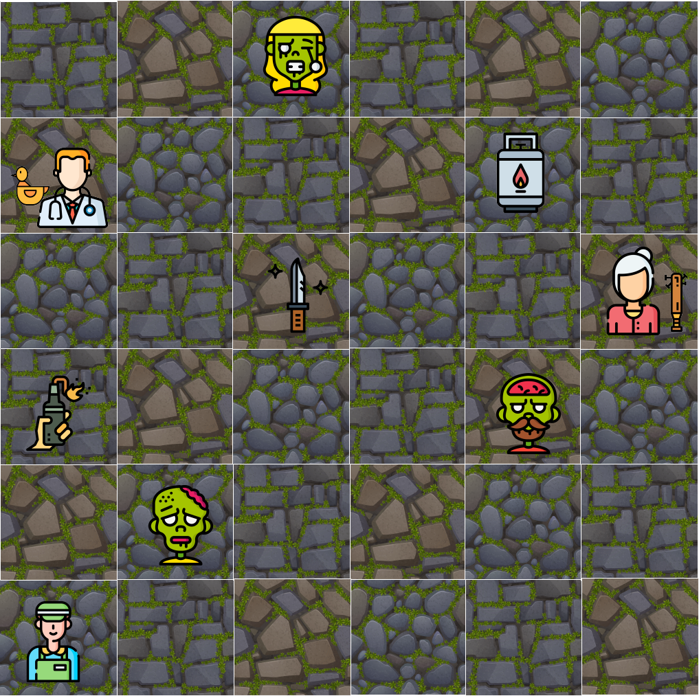

## Zombie apocalypse

## TechSummit Idealist
TechSummit Challenge Statement

---
## Introduction
It is the year 2222 and what seemed like the stuff of science fiction and the stuff of video games or the Walking Dead has become reality: **the zombie apocalypse has begun!** In this new normal it is common to have to face zombies every day to go shopping for bread and let's just say that programming is no longer one of your priorities. You have really had no choice but to become a warrior and use anything that looks like a weapon to fight your way through the undead.

In this infected world we only have one option: survive! 

## Challenge
Given the description of a scenario (map, survivors, zombies, equipment, etc...) and the actions that take place in it (move, attack, equip, etc.), indicate what the final state of that scenario is. 

## Problem description 

Each scenario is defined by
- Map
  - a map on which survivors, zombies and equipment are placed. 
  - the map is always square in shape, e.g. 5 cells long by 5 cells wide
  - neither survivors nor zombies can leave the boundaries of the map. 
  - Note: The coordinate 0 0 is the top left corner of the map.

- Survivors
  - have a unique name
  - have a starting life value
  - have a starting experience value
  - can carry up to 5 items of equipment with them, one in each hand and the rest in their backpacks
  - are always found at some coordinate on the map.

- Zombies
  - have a unique name
  - have only one life point, if they are attacked successfully they die immediately.
  - are always found at some coordinate on the map.

- Equipment
  - are used to attack the zombies
  - they are available in both short and long range
  - there can only be one item of each type in the scenario, they are not repeated
  - some lucky survivors will be lucky enough to be equipped at the start of the stage
  - for the less fortunate, there is also equipment scattered around the map.

Survivors can attack the zombies with different weapons. However, as we are not all warriors by nature, sometimes these attacks are not successful. If the attack is unsuccessful, the zombie does not die. 

On the other hand, zombies even if they are not very agile and cannot use weapons will never miss an opportunity to take you to their club. So if there is a zombie near a survivor it will always try to bite him. 

We consider the battle won if there are no zombies alive on the stage. Otherwise, if there are no survivors at the end of the scenario, we have lost. 

## Input file format
The file defining each scenario is provided in a plain text file. The
file contains only ASCII characters and lines are terminated with a single '\n' character (also called 'UNIX-style' line ending).
 When there are multiple numbers
on a line, they are separated by a single space between each two numbers. 

The input file will have the following format:
```
# General definition of scenario elements (information blocks)
# Definition of survivors
# Definition of zombies
# Definition of items on the map
# Definition of instructions to be executed
```

#### General definition of scenario elements

The first line of the file contains five numbers that describe in general terms the scenario (number of zombies, map size, etc.).
```
S Z I M C

# S = Number of survivors
# Z = Number of zombies
# I = Number of items present on the map 
# M = Size of the map side (square)
# C = Number of instructions to execute

```

#### Definition of survivors

Then, the next block defines the survivors and the equipment they carry. 

Survivors are defined by 
- a mandatory first line that defines the name, initial life, experience level, etc.
- if the survivor has items equipped, there will be an additional line for each item the survivor has. 

*If the survivor has two items equipped, there will be a first line defining the survivor and then two more lines specifying the items.

```
V Ex Eq X Y N

# V = Initial health
# Ex = Initial experience points
# Eq = Number of initial equipped items
# X = X-coordinate
# Y = Y-coordinate
# N = Name
```

```
I S

# I = Item name
# S = Slot in which the survivor holds the Item
```
#### Zombie definition
Next, the file contains Z lines in the following format that define each zombie:
```
N X Y

# N = Zombie name
# X = X-coordinate
# Y = Y-coordinate
```

#### Item definition
Next, the file contains I lines with the following format that define the items distributed over the map:
```
N X Y

# N = Item name
# X = X coordinate
# Y = Y-coordinate
```


#### Example of input file
```
3 1 3 6 1               # S=3 survivors, Z=1 zombie, I=1 item, M=6-side map and C=2 instructions
2 0 1 0 1 Bart          # Survivor N=Bart, V=2 life, Ex=0 experience, Eq=1 items equipped and is at coordinate (X=0, Y=1)
RubberDuck RightHand    # Bart's item, I=RubberDuck equipped on S=Right Hand
2 0 1 5 2 Lisa          # Survivor N=Lisa, V=2 life, Ex=0 experience, Eq=1 item equipped and is on coordinate (X=5, Y=2)
BaseballBat LeftHand    # Lisa's item, I=BaseballBat equipped on S=left hand
2 0 1 0 5 Burns         # Survivor N=Burns, V=5 life, Ex=0 experience, Eq=0 item equipped and is at coordinate (X=0, Y=5)
Zombicillo 2 0          # Zombie N=Zombie, is at the coordinate (X=2, Y=0)
ZombiLoco 1 4           # Zombie N=ZombiLoco, is at coordinate (X=1, Y=4)
ZombiVaquero 4 3        # Zombie N=ZombiVaquero, is at coordinate (X=4, Y=3)
Knife 2 2               # Item N=Knife on the ground at coordinate (X=2, Y=2)
Molotov 0 3             # Item N=Molotov on the ground at coordinate (X=0, Y=3)
Flamethrower 4 1        # Item N=Flamethrower on the ground at coordinate (X=4, Y=1)
M Bart Up               # Instruction to execute
```

The last line of this example contains a [Movement](###Movement) instruction described below.

The file represents this scenario:


*This is only a representation of the scenario. The graphical implementation does not have to be the same as this one.
### Software output: final state of the scenario
The software must generate a log describing the final state of the scenario after executing all commands in the input file.

This file must have the following format:
```
# (1) General definition of scenario elements (blocks of information) 
# (2) Definition of survivors
# (3) Definition of zombies
# (4) Definition of items on the map
# (5) Definition of executed instructions (eliminating any instructions that had no effect)
# (6) Result of the game
```

Each of blocks 1 - 5 has the same internal structure as the input file. Block 6 is defined below.

#### Result of the game
The result of the game is defined by a line in the following format:
```
R

R=Result can be W (won), L (lost) or R (running).

```

#### Example log of the final state of the scenario

```
# Input:
2 0 1 3 2     
2 0 0 0 0 1 Bart 
Knife Backpack
2 0 1 0 0 0 Lisa
BaseballBat LeftHand
A Bart Zombicillo Knife 1
A Lisa Zombicillo BaseballBat 1
```

```
# Log:
2 0 1 3 2     
2 0 0 0 0 1 Bart 
Knife Backpack
2 0 1 0 0 0 Lisa
BaseballBat LeftHand
A Lisa Zombicillo BaseballBat 1
W 
```


*Note: Coordinate 0 0 is the top left corner of the map.


## Definition of instructions
### Movement
All characters, both survivors and zombies, can move one square with this instruction. 

The instruction is defined by a line with the following format:
```
M P D  

# M = Movement
# P = Character
# D = Direction
```

**Example entry:** 
```
2 1 0 3 2     
2 0 0 0 0 1 Bart 
2 0 0 0 0 0 0 Lisa
Zombie 2 0
M Bart Up
M Lisa Right
M Zombicillo Left
```

### Pick up equipment
Survivors can pick up an item according to the following rules:
- They can carry items in the following "slots": `LeftHand`, `RightHand` and `Backpack`.
- The backpack can carry 3 items
- If the survivor picks up something for the backpack and the backpack is full, the instruction has no effect.
- Extra ball:* If the survivor picks something up with one hand and already has something in that hand, what they are currently holding goes into the backpack if possible. If not, the instruction has no effect.

The instruction is defined by a line with the following format:
```
P S I Sl 

# P = Pick up
# S = Survivor
# I = Item
# Sl = Slot
```

**Example entry:**
```
2 1 1 3 2     
2 0 0 0 0 1 Bart 
2 0 0 0 0 0 0 Lisa
Zombie 2 0
BaseballBat 0 0 0
P Lisa BaseballBat LeftHand 
```


## Move Equipment
Survivors can change where their equipment is stored or even drop it by following the rules below:
- Valid destinations are "gaps" (`LeftHand`, `RightHand`, `Backpack`) or the ground (`Floor`).
- The survivor must have that item, otherwise the instruction has no effect.
- The destination must be capable of the item (i.e. no longer have any items in the case of `LeftHand` and `RightHand` or have less than 3 items in the case of `Backpack`) Otherwise, the instruction has no effect. 
- Items can always be moved to `Floor` (regardless of whether there is already something)

The instruction is defined by a line with the following format:
```
R S I T 

# R = Move equipment
# S = Survivor
# I = Item
# T = Equipment destination
```

**Example entry:**
```
2 1 0 3 2     
2 0 0 0 0 1 Bart 
2 0 1 0 0 0 Lisa
BaseballBat LeftHand
Zombie 2 0
R Lisa BaseballBat Backpack
```

## Attack
All characters have the ability to attack according to the following rules:
- Weapons used by survivors can be the items: `BaseballBat`, `RubberDuck`, `Katana`, `Knife`, `Handgun`, `Molotov`, `Flamethrower`, `Machete` or `Bow`.
- The weapon used by zombies is always `Bite`.
- Survivors can attack with the following weapons if they are in the same square as the target zombie: `BaseballBat`, `Katana`, `Knife`, `Machete`, `RubberDuck`.
- RubberDuck` does no damage to the zombie but it makes a funny noise. 
- Survivors can attack from 1 square away using the `Handgun` and `RubberDuck` weapon. 
- Survivors can attack from 2 squares away using the `Molotov` weapon.
- Survivors can attack from 3 squares away using the `Bow` weapon.
- The `Handgun`, `Molotov`, `Flamethrower` and `Bow` weapons cannot be used to attack zombies in the same square as the survivor, if they do, the instruction has no effect.
- Survivors must have the weapon in one hand to be able to attack with it, otherwise the instruction has no effect. 
- Each zombie killed increases experience by 1
- When a survivor is attacked, he/she loses 1 life point.
- If the survivor's life is 0, he dies and all instructions that affect him have no effect. In addition, the survivor does not lose their equipment and it does not fall to the ground, so it cannot be picked up by other survivors in the same square.
- Extra Ball: Some weapons are destroyed after a number of uses, after that number of attacks they are removed from the player's equipment: 
	- `BaseballBat` 1
	- Knife 2
	- Katana` 3
	
The instruction is defined by a line in the following format:
```
A P1 P2 W R 


# A = Attack
# P1 = Character making the attack
# P2 = Character receiving the attack
# W = Weapon used
# R = Whether or not the attack takes effect
```

**Example of same-space attack entry:**
```
2 1 0 3 2     
2 0 0 0 0 1 Bart 
2 0 1 0 0 0 Lisa
BaseballBat LeftHand
Zombie 0 0
A Lisa BaseballBat Zombicillo BaseballBat 1
```

**Example of ranged attack input:**
```
2 1 0 3 2     
2 0 0 0 0 1 Bart 
2 0 1 0 0 0 Lisa
Handgun LeftHand
Zombicillo 1 0
A Lisa Zombicillo Handgun 1
```

**Example of Zombie Attack Entry**
```
2 1 0 3 2     
2 0 0 0 0 1 Bart 
2 0 1 0 0 0 Lisa
Zombie 0 0 0
A Zombicillo Lisa Bite 1
```

## Win and lose the game
If all zombies are dead, the survivors win the game immediately. If all survivors are dead, the survivors lose the game.

**Example of a win game entry:** 
```
2 1 0 3 2     
2 0 0 0 0 1 Bart 
2 0 1 0 0 0 Lisa
BaseballBat LeftHand
Zombie 0 0
A Lisa BaseballBat Zombicillo BaseballBat 1
```

**Example of lost game entry**: 
```
1 1 0 3 2     
1 0 1 0 0 0 Lisa
Zombicillo 0 0
A Zombicillo Lisa Bite 1
```

## Assets
- Zombie free icons designed by Smashicons https://www.flaticon.com/free-icon/zombie_3636891 a través de @flaticon 
- Survivors free icon designed by Freepik https://www.flaticon.com/free-icon/shopkeeper_3194579?term=shopkeeper a través de @flaticon 
- Equipment free icons designed by smalllikeart https://www.flaticon.com/free-icon/baseball-bat_1256792 a través de @flaticon 
- Tiles images have been designed using images from Freepik.com https://www.freepik.com/free-vector/textures-stone-floor-wall-with-green-moss-game-background-vector-cartoon-seamless-patterns-top-view-pavement-with-grass-cobblestones-granite-blocks_23592761.htm#query=ground%20tile&position=41&from_view=search 
